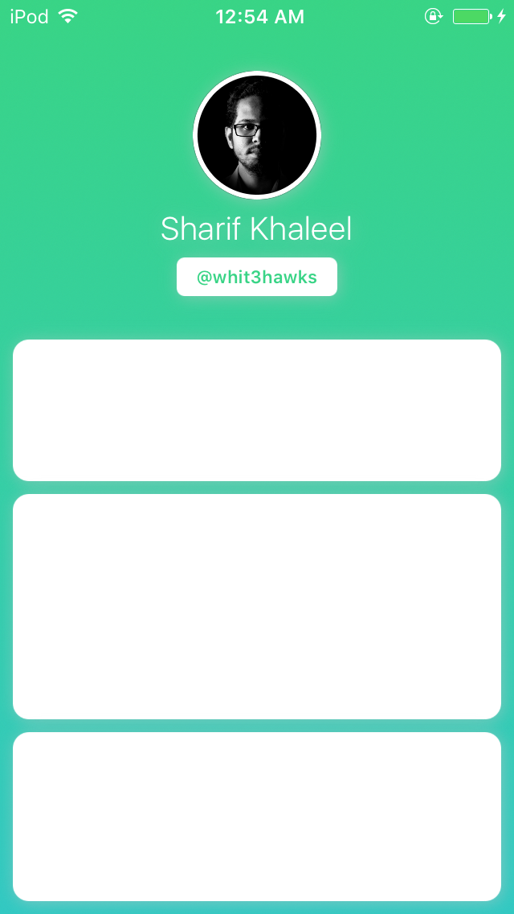

# CommoniOSViews

[](https://travis-ci.org/whitehawks/CommoniOSViews)
[](http://cocoapods.org/pods/CommoniOSViews)
[](http://cocoapods.org/pods/CommoniOSViews)
[](http://cocoapods.org/pods/CommoniOSViews)

## Example

To run the example project, clone the repo, and run `pod install` from the Example directory first.

## Screenshots

<p align="center">

</p>

## Requirements

- iOS 8.0+
- Xcode 8.1+
- Swift 3.0+

## Features

- [x] Gradient UIView (GradientView)
- [x] Shadow UIView (ShadowView)
- [x] Circle UIImage (CircleImageView)
- [x] Round Corner UILabel (CircleImageView)

## Installation

CommoniOSViews is available through [CocoaPods](http://cocoapods.org). To install
it, simply add the following line to your Podfile:

```ruby
pod "CommoniOSViews"
```

## Author

Sharif Khaleel
Twitter at [@whit3hawks](https://twitter.com/whit3hawks)

## License

CommoniOSViews is available under the MIT license. See the LICENSE file for more info.
